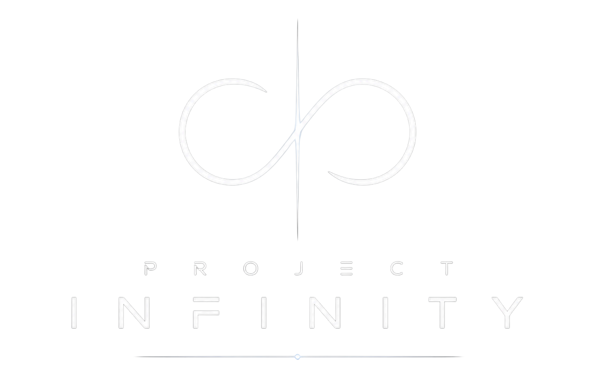

<div align="center">
  <a href="https://projectinfinity.vercel.app">
    
  </a>

  <h3 align="center">Project Infinity</h3>

  <p align="center">
    A cinematic, scroll-based 3D voyage through the cosmos.
    <br />
    <a href="https://projectinfinity.vercel.app"><strong>Explore the Universe »</strong></a>
    <br />
    <br />
  </p>
</div>

---

## 🌌 Overview

**Project Infinity** is a highly immersive, interactive 3D web experience that transforms the browser into a window to the cosmos. Designed with a cinematic approach to web navigation, it leverages seamless scroll-driven storytelling to guide users through a meticulously crafted digital solar system. 

By combining state-of-the-art WebGL rendering with buttery-smooth scroll physics, Project Infinity delivers a premium, app-like exploration experience directly on the web—accessible across both desktop and mobile devices.

## ✨ Key Features

- **Cinematic Scroll Progression:** A bespoke, physics-based scrolling engine (powered by Lenis) that translates your scroll or pinch-to-zoom gestures into a majestic journey through space. 
- **Interactive 3D Solar System:** Rendered entirely in real-time. Click on celestial bodies to lock focus, explore orbits, and interact with the cosmos.
- **Dynamic Lighting & Materials:** Features custom shaders, bloom effects, and dynamic starfields to create a breathtakingly realistic and atmospheric environment.
- **Mobile Optimized:** Full support for touch interactions, including custom pinch-to-zoom logic that maintains the precise cinematic pacing of the desktop experience.
- **Performant by Design:** Built on top of React Three Fiber, ensuring high framerates and efficient memory management even with complex 3D assets.

## 🛠️ Technology Stack

Engineered with modern web technologies for maximum performance and visual fidelity:

- **Framework:** [Next.js 14/15](https://nextjs.org/) (React)
- **3D Engine:** [Three.js](https://threejs.org/) & [React Three Fiber](https://docs.pmnd.rs/react-three-fiber/)
- **3D Helpers:** [@react-three/drei](https://github.com/pmndrs/drei) & [@react-three/postprocessing](https://github.com/pmndrs/react-postprocessing)
- **Scroll Physics:** [Lenis](https://lenis.studiofreight.com/)
- **Animation:** [GSAP](https://gsap.com/) & [Framer Motion](https://www.framer.com/motion/)
- **State Management:** [Zustand](https://github.com/pmndrs/zustand)
- **Styling:** [Tailwind CSS](https://tailwindcss.com/)

## 🚀 Getting Started

To run Project Infinity locally and explore the source code:

### Prerequisites
- Node.js (v18 or higher)
- npm, yarn, or pnpm

### Installation

1. Clone the repository:
   ```sh
   git clone https://github.com/sam-eer31/universe-to-solar-system.git
   ```
2. Navigate to the project directory:
   ```sh
   cd universe-to-solar-system
   ```
3. Install dependencies:
   ```sh
   npm install
   ```
4. Start the development server:
   ```sh
   npm run dev
   ```
5. Open your browser and visit `http://localhost:3000`

## 📱 Interactive Controls

- **Desktop:** Use the scroll wheel to traverse the timeline. Click and drag to rotate the camera view. Click on any planet to focus on it.
- **Mobile:** Use the pinch-to-zoom gesture to travel forward/backward through the cinematic sequence. Swipe to rotate your view. 

---
<div align="center">
  <p>Designed and built for the modern web.</p>
</div>
